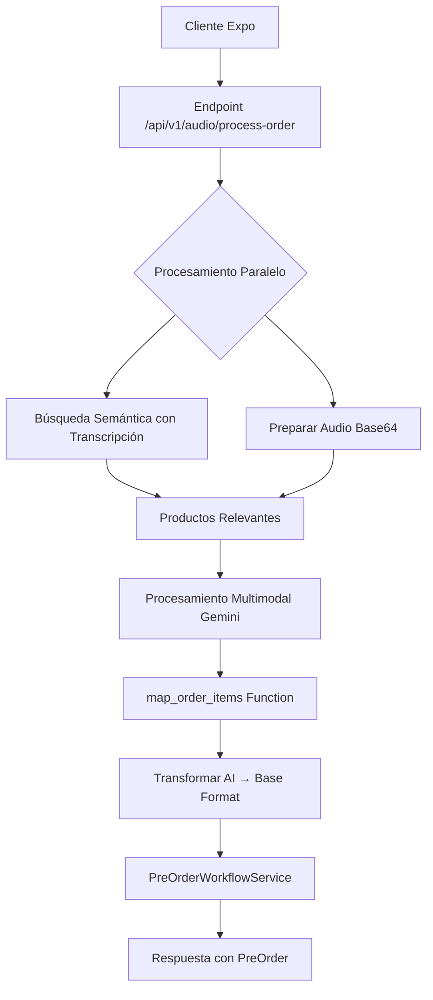

# Diseño de Endpoint Optimizado para Procesamiento de Audio

## Análisis del Backend Actual

### Arquitectura Existente
- **Pipeline de Mensajes**: Webhook → WhatsAppService → MessageProcessor → Middleware Pipeline → Strategy Pattern
- **Procesamiento de Audio Actual**: AudioMessageStrategy descarga y transcribe con Gemini, luego convierte a texto
- **Sistema de Agentes**: General Agent (detección de intención) → Order Agent (mapeo de productos)
- **Búsqueda Semántica**: MenuSearchService con embeddings pre-calculados (text-embedding-004, 768 dimensiones)
- **pgvector**: Índice HNSW para búsqueda eficiente O(log n)

### Estructura de OrderItems
```typescript
// Formato AI (entrada)
interface AIOrderItem {
  productId: string;
  variantId?: string;
  quantity: number;
  modifiers?: string[];
  pizzaCustomizations?: Array<{
    customizationId: string;
    half: "FULL" | "HALF_1" | "HALF_2";
    action: "ADD" | "REMOVE";
  }>;
}

// Formato Base (procesamiento interno)
interface BaseOrderItem {
  productId: string;
  productVariantId?: string;
  quantity: number;
  selectedModifiers?: string[];
  selectedPizzaCustomizations?: PizzaCustomizationData[];
}
```

## Diseño Propuesto

### 1. Nuevo Endpoint
```
POST /api/v1/audio/process-order
Content-Type: multipart/form-data

Body:
- audio: File (archivo de audio desde Expo)
- transcription: string (transcripción nativa de Google)
- orderType: "DELIVERY" | "TAKE_AWAY"
- customerId: string (UUID del cliente)
```

### 2. Flujo de Procesamiento



### 3. Ventajas del Diseño

#### Precisión Mejorada
- **Audio Nativo**: Gemini procesa el audio directamente (más preciso que solo transcripción)
- **Contexto Dual**: Transcripción como guía + audio para detalles precisos
- **Productos Relevantes**: Solo se pasan productos encontrados por búsqueda semántica

#### Optimización de Rendimiento
- **Procesamiento Paralelo**: Búsqueda semántica mientras se prepara el audio
- **Una Sola Llamada a Gemini**: Audio + función en una petición
- **Bypass del Pipeline Complejo**: Evita múltiples middlewares de WhatsApp
- **Cache de Embeddings**: Búsqueda vectorial pre-calculada

#### Simplicidad
- **Sin Dos Agentes**: Procesamiento directo con función forzada
- **Respuesta Estructurada**: Garantizada por `mode: "ANY"`
- **Creación Directa**: PreOrder sin pasos intermedios

### 4. Prompt Especializado para Audio

```
Características del prompt:
1. Reconoce que la transcripción puede tener errores
2. Prioriza el audio para cantidades y detalles
3. Incluye solo productos relevantes del menú
4. Instrucciones claras sobre variantes obligatorias
5. Mapeo directo a IDs del menú
```

### 5. Integración con Expo

```typescript
// Cliente Expo
const formData = new FormData();
formData.append('audio', {
  uri: audioUri,
  type: 'audio/mp4',
  name: 'order.mp4'
});
formData.append('transcription', googleTranscription);
formData.append('orderType', selectedOrderType);
formData.append('customerId', userId);

const response = await fetch(`${API_URL}/api/v1/audio/process-order`, {
  method: 'POST',
  body: formData,
  headers: {
    'Authorization': `Bearer ${token}`
  }
});
```

### 6. Manejo de Errores

- **Productos no encontrados**: Mensaje claro al usuario
- **Audio no procesable**: Solicitar repetir la orden
- **Variantes faltantes**: Identificar y solicitar aclaración
- **Errores de red**: Reintentos automáticos

### 7. Consideraciones de Seguridad

- **Autenticación**: Bearer token requerido
- **Validación de Cliente**: Verificar que customerId existe
- **Rate Limiting**: Limitar peticiones por cliente
- **Tamaño de Audio**: Límite máximo configurable

### 8. Métricas de Rendimiento Esperadas

- **Búsqueda Semántica**: ~50ms (índice HNSW)
- **Procesamiento Gemini**: ~2-3s (audio + función)
- **Creación PreOrder**: ~100ms
- **Total**: ~3-4s end-to-end

### 9. Próximos Pasos para Implementación

1. Crear el servicio `AudioOrderService`
2. Implementar la ruta en Express
3. Agregar validación con DTOs
4. Implementar middleware de autenticación
5. Agregar logging y métricas
6. Pruebas unitarias y de integración
7. Documentación de API

### 10. Consideraciones Adicionales

- **Streaming**: Considerar respuesta en streaming para UX más rápida
- **Caché**: Cachear productos frecuentes para reducir búsquedas
- **Fallback**: Si falla el audio, usar solo transcripción
- **Idiomas**: Soporte multiidioma en el prompt