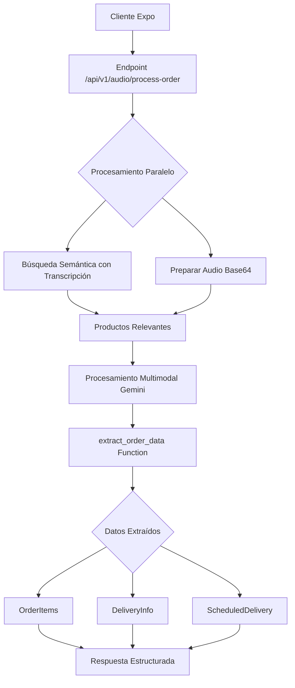

# Diseño de Endpoint Optimizado para Procesamiento de Audio

## Análisis del Backend Actual

### Arquitectura Existente
- **Pipeline de Mensajes**: Webhook → WhatsAppService → MessageProcessor → Middleware Pipeline → Strategy Pattern
- **Procesamiento de Audio Actual**: AudioMessageStrategy descarga y transcribe con Gemini, luego convierte a texto
- **Sistema de Agentes**: General Agent (detección de intención) → Order Agent (mapeo de productos)
- **Búsqueda Semántica**: MenuSearchService con embeddings pre-calculados (text-embedding-004, 768 dimensiones)
- **pgvector**: Índice HNSW para búsqueda eficiente O(log n)

### Estructura de Datos

```typescript
// Formato AI (entrada)
interface AIOrderItem {
  productId: string;
  variantId?: string;
  quantity: number;
  modifiers?: string[];
  pizzaCustomizations?: Array<{
    customizationId: string;
    half: "FULL" | "HALF_1" | "HALF_2";
    action: "ADD" | "REMOVE";
  }>;
}

// Información de Entrega
interface DeliveryInfoData {
  fullAddress?: string;         // Dirección completa
  recipientName?: string;       // Nombre del destinatario
  recipientPhone?: string;      // Teléfono del destinatario
}

// Entrega Programada
interface ScheduledDeliveryData {
  time?: string; // Hora en formato HH:mm (solo captura la hora del audio)
}

// Respuesta del Procesamiento
interface AudioProcessingResult {
  orderItems?: AIOrderItem[];
  orderType?: "DELIVERY" | "TAKE_AWAY" | "DINE_IN";
  deliveryInfo?: DeliveryInfoData;
  scheduledDelivery?: ScheduledDeliveryData;
  warnings?: string;
}
```

## Diseño Propuesto

### 1. Nuevo Endpoint
```
POST /api/v1/audio/process-order
Content-Type: multipart/form-data
X-API-Key: {CLOUD_API_KEY}

Body:
- audio: File (archivo de audio desde app de trabajadores)
- transcription: string (transcripción nativa de Google)
```

**Campos Soportados en la Extracción:**
- **orderItems**: Productos del menú con cantidades, variantes y modificadores
- **orderType**: Tipo de orden inferido (DELIVERY si menciona dirección, TAKE_AWAY si menciona recoger, DINE_IN por defecto)
- **deliveryInfo**: Información de entrega (dirección, destinatario, teléfono)
- **scheduledDelivery**: Hora de entrega programada

Todos los campos son opcionales y solo se extraen si son mencionados explícitamente en el audio.

### 2. Flujo de Procesamiento



### 3. Ventajas del Diseño

#### Precisión Mejorada
- **Audio Nativo**: Gemini procesa el audio directamente (más preciso que solo transcripción)
- **Contexto Dual**: Transcripción como guía + audio para detalles precisos
- **Productos Relevantes**: Solo se pasan productos encontrados por búsqueda semántica

#### Optimización de Rendimiento
- **Procesamiento Paralelo**: Búsqueda semántica mientras se prepara el audio
- **Una Sola Llamada a Gemini**: Audio + función en una petición
- **Bypass del Pipeline Complejo**: Evita múltiples middlewares de WhatsApp
- **Cache de Embeddings**: Búsqueda vectorial pre-calculada

#### Simplicidad
- **Sin Dos Agentes**: Procesamiento directo con función forzada
- **Respuesta Estructurada**: Garantizada por `mode: "ANY"`
- **Solo Mapeo**: Devuelve items procesados sin crear órdenes

### 4. Prompt Especializado para Audio

```
Características del prompt:
1. Reconoce que la transcripción puede tener errores
2. Prioriza el audio para cantidades y detalles
3. Incluye solo productos relevantes del menú
4. Instrucciones claras sobre variantes obligatorias
5. Mapeo directo a IDs del menú
6. Extracción inteligente de múltiples tipos de datos
7. Solo captura información mencionada explícitamente
```

**Ejemplos de Extracción Inteligente:**

- **Solo productos**: "Quiero dos pizzas grandes hawaianas"
  - Resultado: Solo `orderItems` con los productos

- **Productos + dirección**: "Una hamburguesa para entregar en Calle Juárez 123"
  - Resultado: `orderItems` + `deliveryInfo.fullAddress`

- **Entrega programada**: "Dos tacos al pastor para las 3 de la tarde"
  - Resultado: `orderItems` + `scheduledDelivery.time` (15:00)

- **Información completa**: "Pedido para Juan Pérez, teléfono 555-1234, entregar en Av. Reforma 222, a las 8 de la noche"
  - Resultado: Todos los campos de `deliveryInfo` + `scheduledDelivery.time` (20:00)

### 5. Integración con App de Trabajadores

```typescript
// Cliente App Trabajadores
const formData = new FormData();
formData.append('audio', {
  uri: audioUri,
  type: 'audio/mp4',
  name: 'order.mp4'
});
formData.append('transcription', googleTranscription);

const response = await fetch(`${API_URL}/api/v1/audio/process-order`, {
  method: 'POST',
  body: formData,
  headers: {
    'X-API-Key': CLOUD_API_KEY
  }
});

// Respuesta
{
  "success": true,
  "data": {
    "orderItems": [
      {
        "productId": "PZ",
        "variantId": "PZ-V-1",
        "quantity": 2,
        "modifiers": [],
        "pizzaCustomizations": [...]
      }
    ],
    "orderType": "DELIVERY",
    "deliveryInfo": {
      "fullAddress": "Calle Juárez 123, Colonia Centro",
      "recipientName": "Juan Pérez",
      "recipientPhone": "555-1234567"
    },
    "scheduledDelivery": {
      "time": "14:30"
    },
    "warnings": "No pude identificar el tamaño de las bebidas"
  }
}
```

### 6. Manejo de Errores

- **Productos no encontrados**: Mensaje claro al usuario
- **Audio no procesable**: Solicitar repetir la orden
- **Variantes faltantes**: Identificar y solicitar aclaración
- **Errores de red**: Reintentos automáticos

### 7. Consideraciones de Seguridad

- **Autenticación**: X-API-Key header con CLOUD_API_KEY
- **Middleware**: Adaptar o crear middleware similar a `syncAuthMiddleware`
- **Rate Limiting**: Limitar peticiones globalmente por API key
- **Tamaño de Audio**: Límite máximo configurable

### 8. Métricas de Rendimiento Esperadas

- **Búsqueda Semántica**: ~50ms (índice HNSW)
- **Procesamiento Gemini**: ~2-3s (audio + función)
- **Total**: ~2-3s end-to-end

### 9. Próximos Pasos para Implementación

1. Crear el servicio `AudioOrderService`
2. Implementar la ruta en Express
3. Agregar validación con DTOs
4. Crear o adaptar middleware de autenticación para CLOUD_API_KEY
5. Agregar logging y métricas
6. Pruebas unitarias y de integración
7. Documentación de API

### 10. Consideraciones Adicionales

- **Streaming**: Considerar respuesta en streaming para UX más rápida
- **Caché**: Cachear productos frecuentes para reducir búsquedas
- **Fallback**: Si falla el audio, usar solo transcripción
- **Idiomas**: Soporte multiidioma en el prompt